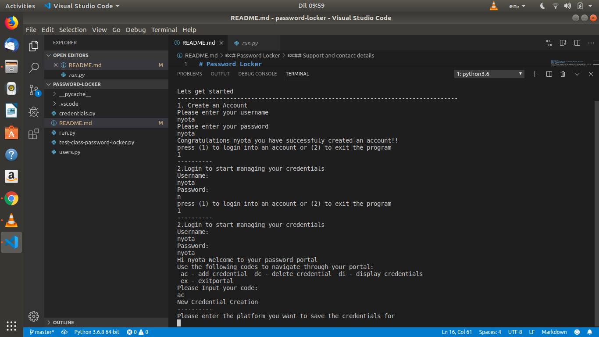
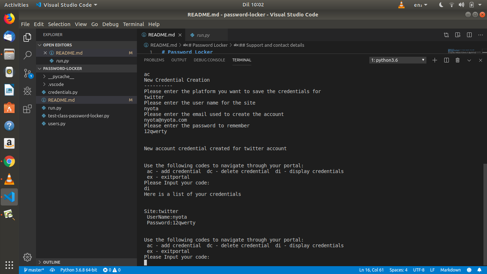

# Password Locker
#### Password Locker application for storing your passwords, 1-Sep-2019
#### By **Kingecha Kevin Nyota**
## Description
This is a Terminal run application that Helps users store their passwords safely since their are so many accounts this days and its very difficult to remember all of them.
## Screen Shots
Here is an overview of how the application works

 
## Setup/Installation Requirements
* Ensure that Python is installed on your machine if not please visit the python website and download the latest version python 3.6
* Fork the repository and either download the project or clone it to your machine
* Run the the code chmod +x run.py on your terminal
* run the program now using ./run.py command on the terminal
## Known Bugs
There are no known bug if any dont hesitate to contact me
## Technologies Used
1.) Python Version 3.6
## Support and contact details
if you run into any issues please contact knyota66@gmail.com
### License
*MIT*
Copyright (c) 2019 **Kingecha Kevin Nyota**